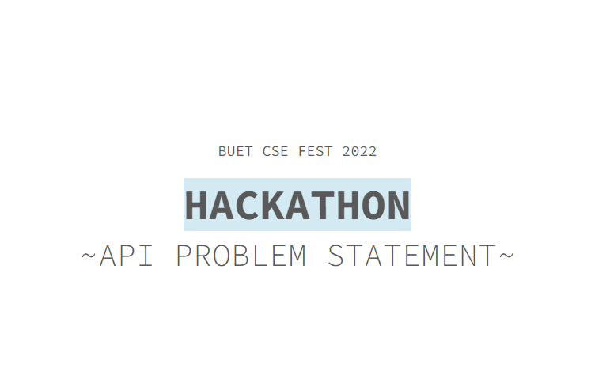

### BUET Hackathon 2022
#### 🏆 This repository won the best documentation prize in BUET CSE Hackathon 2022
#### 🤞 Team Name: Scapegoat 
#### 💪 Participated in: API & Cloud Segment 

#### This project is divided into three parts.

1. voice_assistant.py: A sample voice_assistant writtent in python. It communicates with the back-end apis.
2. scapegoat-api/Home assistant api: This is our custom api to communicate with other apis.
3. drf_api: A CRUD api with API authentication made using django-rest-framework.

#### The external apis that we used: 
- Spotify Web API
- Wikipedia API
- News API
- Google Map API

#### Python SDKs used:
- Speech Recognition
- Pyttsx3
- Wikipedia
- News 
- Spotipy

#### Problem Statement [Link](http://tiny.cc/hackathon-api-problem)

### 📃 API Documentation Links 

#### Notes Taking App API Documentation: https://documenter.getpostman.com/view/16524759/VUjLK6sr
#### Home Assistant API Documentation: https://documenter.getpostman.com/view/16524759/VUjLKRyZ

#### Contact With Us
> [Shovon Karmaker](mailto:shuvo.csecu17@gmail.com)
> [Md. Alamin](mailto:mdalaminbijoy3@gmail.com)
> [Md. Zahin Uddin](mailto:zahinuddin5@gmail.com)
